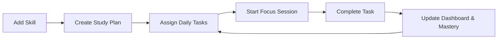

# 📘 LearnMate: User Guide

Welcome to **LearnMate** (also known as TaskPilot), your ultimate productivity and skill-tracking companion. This guide will help you navigate the platform and make the most of its features to achieve your learning goals.

---

## 🚀 Getting Started

### 1. Registration & Setup
- **Sign Up**: Create an account using your email and a strong password.
- **Verification**: Check your email for a verification code to activate your account.
- **Initial Goals**: Upon first login, you'll be prompted to set your daily available hours. This helps the platform calculate your targets.

---

## 📊 The Dashboard: Your Command Center
The Dashboard provides a real-time overview of your productivity.

### Core Metrics
- **Study Hours**: Tracks your "Actual" vs "Planned" study time for today.
- **Tasks Completed**: A progress bar showing the percentage of your daily tasks finished.
- **Focus Score**: A unique metric (0-100%) that measures your time efficiency.
    - **Formula**: `(Planned Time ÷ Actual Time) × 100`
    - *Tip*: A score near 100% means you're estimating your time perfectly!
- **Study Streak**: Keeps track of how many consecutive days you've been active. Don't break the chain! 🔥
- **Activity Heatmap**: A visual 7-day grid showing your study intensity.

---

## 🎓 Skill Manager: Track Your Mastery
The Skill Manager is where you define what you want to learn.

- **Add Skills**: Categorize skills (e.g., Programming, Language, Design).
- **Set Targets**: Define how many hours you want to dedicate to a skill weekly.
- **Mastery Progress**: As you complete tasks related to a skill, your mastery percentage grows. 
- **Priority Levels**: Mark skills as High, Medium, or Low priority to organize your focus.

---

## 🗓️ Study Plan & To-Do List
Organize your daily life with structured tasks.

- **Create Tasks**: Add tasks with planned durations and link them to specific skills.
- **Scheduling**: Assign tasks to specific dates to build your roadmap.
- **Completion**: Once finished, mark tasks as complete to update your Dashboard and Skill Mastery.

---

## ⏱️ Focus Sessions: Deep Work Timer
Use the Focus Session page to eliminate distractions.

- **Select Duration**: Choose from presets (15, 25, 45 mins) or set a custom time.
- **Start Focus**: A minimalist timer helps you stay locked into your current task.
- **Rest & Repeat**: Use the Pomodoro-style flow to maintain long-term productivity without burnout.

---

## 📈 Progress & Analytics
Dive deeper into your data to understand your growth patterns.

- **Weekly Breakdown**: See how your hours are distributed across different days.
- **Skill Distribution**: A pie chart showing which skills are consuming most of your time.
- **Historical Data**: Look back at previous weeks to see how far you've come.

---

## 🛠️ Pro Tips for Success
1. **Be Realistic**: When setting "Planned Duration" for tasks, be honest. This makes your Focus Score more accurate.
2. **Consistent Check-ins**: Update your tasks daily to keep your streaks and heatmap accurate.
3. **Use Focus Mode**: Don't just track time; use the Focus Timer to actually perform the work.

---

## 🔄 Typical User Workflow

---

*Happy Learning!* 🚀
